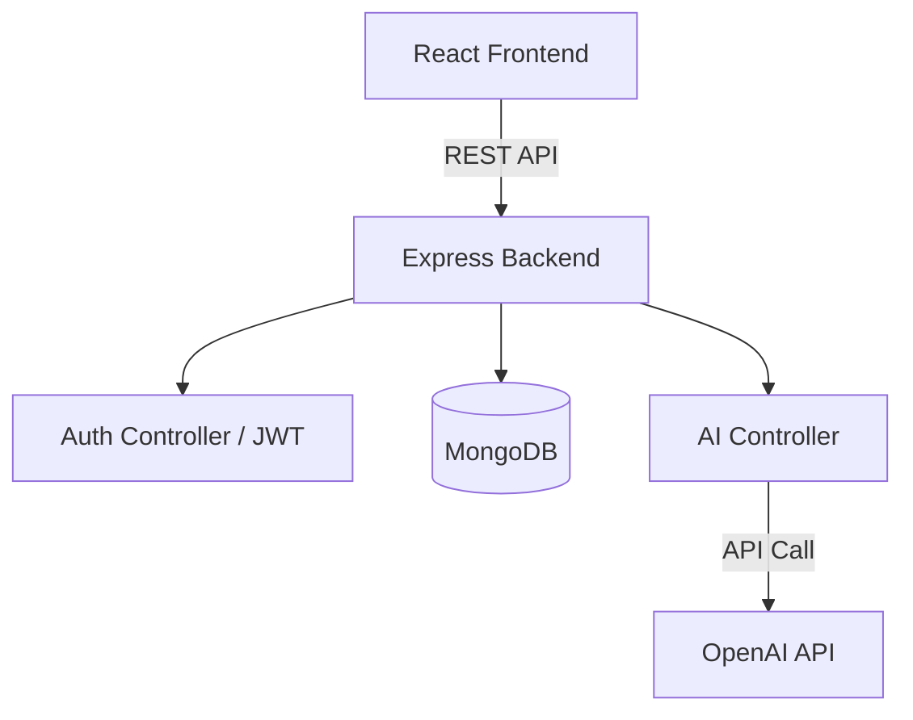

# AI Resume Builder

A full-stack, production-ready AI-powered resume builder allowing users to create beautifully formatted resumes, generate professional summaries via AI, and export to PDF.

## Tech Stack
- **Frontend**: React (Vite), Tailwind CSS, Redux Toolkit, React Router, React Hook Form, zod, html2pdf.js
- **Backend**: Node.js, Express, MongoDB (Mongoose), JWT Auth, OpenAI API integration

## Architecture Diagram


## Setup Instructions

### 1. Backend Setup
1. Open a terminal and navigate to the `server/` directory.
2. Ensure you have MongoDB running locally (`mongodb://127.0.0.1:27017/resumeDB`).
3. Set your environment variables in `server/.env`.
4. Install dependencies:
   ```bash
   npm install
   ```
5. Start the backend server:
   ```bash
   npm run dev
   ```
   *The server will start on http://localhost:5000*

### 2. Frontend Setup
1. Open another terminal and navigate to the `client/` directory.
2. Install dependencies:
   ```bash
   npm install
   ```
3. Start the Vite dev server:
   ```bash
   npm run dev
   ```
   *The frontend will start on http://localhost:5173*

## API Documentation

| Method | Route | Description | Auth Required |
| ------ | ----- | ----------- | ------------- |
| POST | `/api/auth/register` | Register a new user | No |
| POST | `/api/auth/login` | Authenticate a user | No |
| GET | `/api/resumes` | Get all resumes for user | Yes |
| POST | `/api/resumes` | Create a new resume | Yes |
| GET | `/api/resumes/:id` | Get specific resume | Yes |
| PUT | `/api/resumes/:id` | Update resume | Yes |
| DELETE | `/api/resumes/:id` | Delete resume | Yes |
| POST | `/api/ai/generate-summary` | Generate AI Summary | Yes |

*Note: For the test environment, the AI route uses a mock response. Replace the logic in `aiController.js` configuring the OpenAI SDK when keys are available.*
